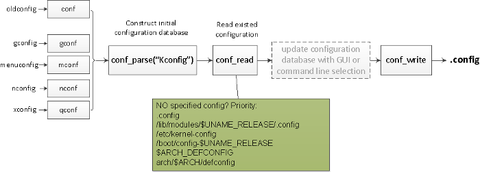

# Understanding the Linux Kernel Build Lifecycle: From Source to Binary

**리눅스 커널** 은 사용자 응용 프로그램과 컴퓨터 하드웨어 사이에서 모든 상호작용을 중재하는 최상위 관리자이자 추상화 계층

**리눅스 커널 빌드 프로세스:** 수많은 소스 코드를 사용자의 시스템 환경에 맞춰 최적화된 **단일 바이너리 이미지**로 만드는 복잡한 과정이다. 이 과정은 크게 **소스 준비 및 초기화**, **커널 설정(Config)**, **컴파일 및 바이너리 생성(Binary)** 단계로 나뉜다.

## 1. The Foundation: Kernel Source Tree
커널 소스는 수만 개의 파일로 구성되어 있으며, 아키텍처 독립적인 코드와 의존적인 코드가 엄격히 분리되어 있다.
- `arch/` : 각 CPU 아키텍처(x86, ARM, RISC-V 등)별 특화된 코드가 담긴 곳
- `drivers/` : 하드웨어 제어를 위한 드라이버 코드의 집합소
- `kernel/`, `mm/`, `fs/` : 프로세스 관리, 메모리 관리, 파일 시스템 등 핵심 로직

## 2. The Blueprint: Kernel Configuration (`.config`)
빌드 전, 어떤 기능을 포함하고 어떤 하드웨어를 지원할지 결정하는 단계이다. 리눅스 커널은 **Kconfig** 시스템을 사용하여 수천 개의 옵션 간 의존성을 관리한다.
- **Kconfig System:** 각 디렉토리의 `Kconfig` 파일이 옵션 간의 Dependency를 정의한다.
- **The `.config` File:** 사용자의 선택 결과가 저장되는 최종 명세서이다. 빌드 시스템은 이 파일을 참조하여 어떤 소스 파일을 컴파일할지 결정한다.
- **Compilation Types:**
    - **Built-in(`y`):** 커널 이미지(`vmlinux`)에 직접 포함된다. 부팅 시 바로 메모리에 로드된다.
    - **Modular(`m`):** 별도의 파일(`.ko`)로 빌드되어 필요할 때 동적으로 로드된다. 커널 크기를 줄이는 데 효과적

## 3. The Transformation: Compilation & Toolchain
설정이 완료되면 `make` 명령을 통해 실제 컴파일이 시작된다. 이때 *Kbuild*라는 특수한 빌드 시스템이 동작한다.
- **Role of Kbuild:** 수많은 디렉토리를 재귀적으로 탐색하여 `.config` 내용에 맞춰 `gcc`나 `clang`을 호출한다.
- **Architecture-Specific Logic:** `arch/$(SRCARCH)/Makefile`이 먼저 읽혀 해당 CPU에 최적화된 컴파일 옵션을 설정한다.
- **Object Files:** 각 `.c` 파일은 기계어로 번역된 `.o`(Object file)가 된다.

## 4. The Result: Final Kernel Image Generation
흩어져 있는 오브젝트 파일들을 하나로 묶어 실행 가능한 바이너리를 만드는 최종 단계이다.
- **vmlinux:** 커널의 본체라고 할 수 있는 거대한 ELF 형식의 비압축 바이너리이다. 디버깅 정보가 포함되어 있어 크기가 매우 크다.
- **Image Compression:** 부팅 속도와 저장 공간을 위해 `vmlinux`를 압축한다. (예: `gzip`, `xz`)
- **The Bootable Image(`bzImage`):** 압축된 커널 데이터에 **부트 스트랩 코드(Setup code)** 를 합친 최종 결과물이다. 부팅 시 이 스트랩 코드가 먼저 실행되어 압축을 풀고 커널을 메모리에 올린다.

## Summary of the Flow
1. **Source:** 수만 개의 소스 코드 존재.
2. **Config:** `Kconfig`를 통해 원하는 기능만 선택 (`.config`).
3. **Build:** `Kbuild` 시스템이 선택된 코드만 컴파일하여 `.o` 생성.
4. **Link:** 오브젝트들을 묶어 `vmlinux` 생성.
5. **Pack:** 압축 및 부트 로직을 추가하여 실제 부팅 가능한 `bzImage` 완성.

## Reference
- The Linux Kernel Archives(https://www.kernel.org/)
- [리눅스] 커널 컴파일(Kernel Compile) - 별의 블로그(https://starrykss.tistory.com/1971)