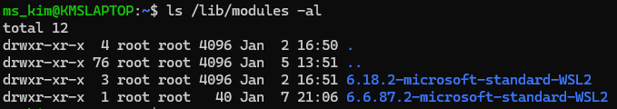

이제 빌드한 리눅스 커널을 설치해서 부팅하는 법을 알아보자.

# 1. 커널 모듈 설치하기
가장 먼저 커널 모듈(`*.ko`)과 이미지 파일(`arch/x86/boot/bzImage`)을 설치해야 한다.

```bash
sudo make O=../build-for-linux-stable/ modules_install
```

위 명령어를 통해서 설치하도록 한다.

설치가 끝나면  `/lib/modules` 디렉토리에서 그 결과를 확인할 수 있다.



이전에 빌드했던 커널 버전의 폴더가 있는지 확인해보자. 필자의 경우 `6.18.2` 버전의 커널을 빌드했고, 모듈 역시 잘 설치되었다. 참고로 밑에 있는 `6.6.87.2`은 이전에 빌드한 버전이다.

# 2. 커널 설치하기
모듈 설치가 끝났다면 마지막으로 커널 이미지 파일을 설치해야 한다.

```bash
sudo make O=../build-for-linux-stable/ install
```


위 이미지를 설치를 완료하고 한번 더 설치한 화면의 모습이다. 실제로는 시간이 좀 걸릴 것이다.

설치가 완료되면 `/boot` 경로에서 커널 이미지 파일을 확인할 수 있다.


`vmlinuz-6.18.2`가 앞서 설명했던 커널 이미지 파일이다. 그 외에도 `config` 파일 역시 확인할 수 있다.

# 3. 부팅하기
원래 같으면 재부팅 후 `grub`창에서 원하는 커널 버전을 선택해서 부팅하려고 했다. 그러나 필자의 컴퓨터 환경에서는 해당 실습을 진행하지 못했다(!). 왜인고하니 **WSL2는 일반적으로 PC부팅이나 VM처럼 GRUB 부팅 화면을 거치지 않기** 때문이다.

WSL2는 마이크로소프트가 미리 빌드해둔 커널을 사용해서 윈도우 위에서 아주 빠르게 실행되는 방식이다. 그래서 재부팅할 때 GRUB 창이 뜨게 만드는 것은 불가능하다.

그래서 대안으로 원하는 특정 커널 (`6.18.2` 등)로 WSL2가 동작하도록 설정하는 방법을 알아보자.
(참고로 필자는 쫄보여서 아직 직접 실행해보진 않았다)

## 3-1. 커널 파일 준비하기
커널 이미지 파일 (`vmlinux` 또는 `bzImage`)을 윈도우의 특정 폴더에 저장하자
- e.g. `C:\Users\사용자이름\wsl_kernel\vmlinux`

## 3-2. `.wslconfig` 파일 수정하기
WSL2가 시작될 때 어떤 커널을 사용할지 알려주는 설정 파일을 만들어야 한다.
    
1. 윈도우 탐색기 주소창에 `%USERPROFILE%`을 입력하고 엔터를 친다.

2. 해당 폴더에 `.wslconfig`라는 이름의 파일을 만들자 (이미 있다면 open한다.) [참고](../daily_log/2025/2025-12-27.md)

3. 메모장을 열어서 아래 내용을 입력해주자.
```txt
[wsl2]
kernel=C:\\Users\\사용자이름\\wsl_kernel\\vmlinux
```
    *주의! 경로를 입력할 때 백슬래시(\)를 두 개(\\)씩 써야 인식이 잘 됨.

## 3-3. WSL2 완전히 종료 후 다시 시작
설정을 적용하려면 현재 실행 중인 모든 WSL을 완전히 꺼야 한다.

1. PowerShell이나 CMD를 권리자 권한으로 연다.

2. 다음 명령어를 입력한다.

```PowerShell
wsl --shutdown
```

3. 이제 다시 Ubuntu를 실행하면 설정한 커널로 부팅이 된다!

## 3-4. 적용 확인하기
Ubuntu 터미널에서 커널 버전을 확인해보자.
```bash
uname -r
```

6.18.2 버전이 출력되면 성공!
---
- **GRUB가 꼭 필요한 경우:** 만약 커널 선택 화면(GRUB)이 반드시 필요하다면, WSL2가 아닌 Hyper-V나 VMware 같은 정식 가상머신을 사용해야 한다. WSL2는 구조상 윈도우 커널 서비스의 일부로 돌아가기 때문에 부트로더 선택 과정을 생략한다.

- **커널 빌드:** 혹시 커널을 직접 빌드한 게 아니라면, 해당 버전이 WSL2 환경에 최적화된 설정(Config)으로 빌드되었는지 꼭 확인해야 정상적으로 작동한다.

# References
- [Blog] mythos.log: Linux Tutorial #1 (부팅하기)
- [Book] 리눅스 커널 소스 해설: 기초입문 (정재준 저)
- [Setting] Microsoft 공식 문서: .wslconfig 설정 가이드